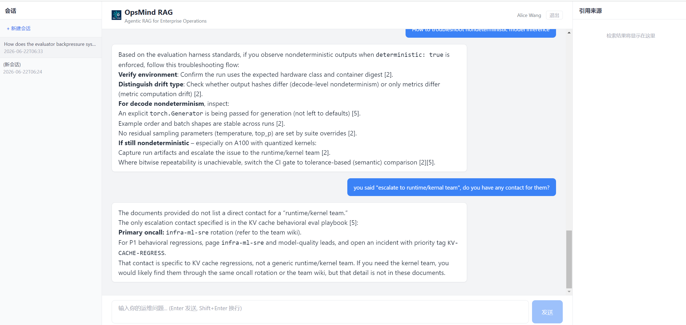

# OpsMind RAG

> **Agentic RAG Platform for Enterprise Operations** — 混合检索 · 多 Agent 协作 · 流式推理 · 人机协作

<p align="center">
  
</p>

---

## 架构

```
用户查询 → FastAPI (SSE) → RetrieveAgent → Milvus Hybrid Search → ReasonAgent → DeepSeek-v4 → 流式输出
                              ↑                    ↑                    ↓
                          FastEmbed           HNSW + RRF           Citation + 溯源
```

### 技术栈

| 层 | 技术 |
|---|------|
| **前端** | React 18 + TypeScript + Vite + Tailwind CSS |
| **API** | FastAPI + SSE 流式输出 |
| **向量库** | Milvus 2.4 Standalone (HNSW 索引 + RRFRanker 融合) |
| **Embedding** | BGE-small-en-v1.5 (FastEmbed/ONNX, 384d) |
| **LLM** | DeepSeek-v4-pro (兼容 OpenAI API) |
| **数据** | EnterpriseRAG-Bench 数据集 |

### 核心能力

- **混合检索** — Milvus `hybrid_search()` 稠密向量检索 + 内置 RRFRanker 融合
- **多轮对话** — 自动携带最近 10 轮历史消息，LLM 感知会话上下文
- **流式推理** — SSE (Server-Sent Events) 逐 token 推送，实时显示生成过程
- **溯源引用** — 每个回答附带精确来源标记 `[1] [2]`，可追溯到文档名和片段
- **可扩展** — Connector/Tool 接口抽象，新增数据源和工具零代码侵入
- **生产就绪** — Docker Compose 一键部署，Milvus 存算分离架构

---

## 快速开始

### 环境要求

- Python 3.10+ / Node.js 18+ / Docker 24+

### 1. 启动 Milvus

```bash
docker compose up -d
```

### 2. 安装依赖 & 摄入数据

```bash
pip install fastapi uvicorn pymilvus pydantic-settings openai fastembed httpx

# 摄入 EnterpriseRAG-Bench 文档 (>250 chunks)
python scripts/ingest.py
```

### 3. 配置 API Key

```bash
# 环境变量方式（推荐）
set LLM_API_KEY=sk-your-deepseek-api-key

# 或编辑 .env 文件
cp .env.example .env
```

### 4. 启动服务

```bash
# 后端
uvicorn app.api.main:app --host 0.0.0.0 --port 8000

# 前端（另开终端）
cd frontend && npm install && npm run dev
```

访问 `http://localhost:5173` 开始对话。

### 5. Milvus 管理面板 (Attu)

```bash
# 已集成在 docker-compose 中
docker compose up -d attu
```

访问 `http://localhost:8001` 浏览 `opsmind_chunks` collection，支持搜索、查看 schema、数据预览。

---

## API 接口

| 接口 | 方法 | 说明 |
|------|------|------|
| `/api/query` | GET (SSE) | 流式问答 — 检索 → 推理 → 逐 token 推送 |
| `/api/retrieve` | POST | 纯检索接口（调试用） |
| `/api/resume` | POST | 中断恢复 |
| `/health` | GET | 健康检查 |

### SSE 事件流

```
event: agent_start       → {"agent_id": "retrieve"}
event: retrieval_result  → {"num_results": 5, "latency_ms": 280}
event: agent_start       → {"agent_id": "reason"}
event: chunk             → {"content": "根据..."}
event: final_answer      → {"answer": "...", "citations": [...]}
```

---

## 示例问题

基于 EnterpriseRAG-Bench (SRE/ML-ops) 文档的测试问题：

| 问题 | 检索目标 |
|------|---------|
| How to ensure deterministic evaluation results in CI? | CI Eval Determinism and Flake Mitigation |
| What is the retention policy evaluation process? | ADR-017: Retention Policy |
| How does the evaluator backpressure system work? | Evaluator Backpressure Playbook |
| How to validate a new model before production rollout? | Cohort-driven Shadow Validation |
| What observability is required for regulated VPC deploys? | Tenant Observability Contract |

```bash
# CLI 快速测试
curl "http://localhost:8000/api/retrieve" -H "Content-Type: application/json" -d '{"query":"deterministic evaluation CI flake","top_k":3}'
```

---

## 项目结构

```
opsmind-rag/
├── app/                             # 后端
│   ├── config.py                    # 配置 (Pydantic Settings)
│   ├── models/                      # Document, Chunk, Citation
│   ├── connectors/                  # 可插拔数据接入层
│   ├── retrieval/                   # Chunker, Embedder, VectorStore
│   ├── agents/                      # RetrieveAgent, ReasonAgent
│   └── api/                         # FastAPI + SSE 端点
├── frontend/                        # React + Vite + Tailwind
├── scripts/                         # 数据摄入、冒烟测试、Milvus 浏览器
├── docs/                            # PRD, HLD, LLD 设计文档
├── docker-compose.yml               # Milvus Standalone (etcd + minio + milvus)
├── start_demo.bat                   # Windows 一键启动
├── DEV_MANUAL.md                    # 开发手册
└── DEPLOYMENT.md                    # 生产部署文档
```

---

## 文档

| 文档 | 说明 |
|------|------|
| [PRD](docs/PRD_OpsMind_RAG.md) | 产品需求文档 |
| [HLD](docs/HLD_OpsMind_RAG.md) | 总体架构设计 |
| [LLD-01](docs/LLD_OpsMind_RAG_01_用户交互层.md) | 用户交互层详细设计 |
| [LLD-02](docs/LLD_OpsMind_RAG_02_API网关层.md) | API 网关层详细设计 |
| [LLD-03](docs/LLD_OpsMind_RAG_03_编排与运行时层.md) | 编排与运行时层详细设计 |
| [LLD-04](docs/LLD_OpsMind_RAG_04_Agent层.md) | Agent 层详细设计 |
| [LLD-05](docs/LLD_OpsMind_RAG_05_数据与基础设施层.md) | 数据与基础设施层详细设计 |
| [DEV_MANUAL](DEV_MANUAL.md) | 开发手册 |
| [DEPLOYMENT](DEPLOYMENT.md) | 生产部署文档 |

---

## License

MIT
